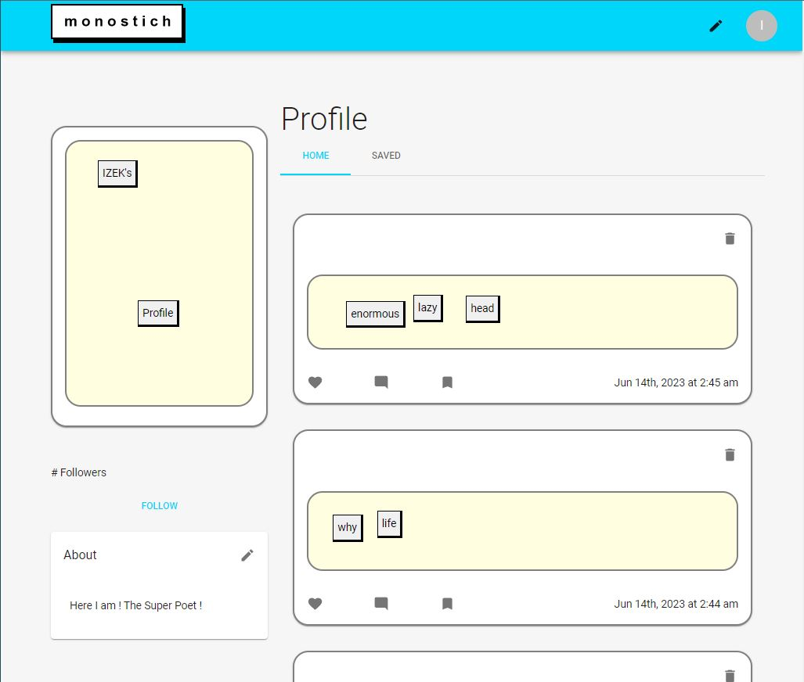

# Monostich

Link to site: [Site](https://sheltered-hollows-11874.herokuapp.com/)

## Description

Monostich is a poetry building social experience. You can build poems in an experience akin to fridge magnets and share them on your profile for all to see. You can explore other profiles and soon follow, like, comment, and save other users and their work.

## Dependencies

This project was made using React, MongoDB, GraphQL, MUI, and more.

This was a group project!
You can reach us at our githubs:

- [jgerona](https://github.com/jgerona)
- [Twenty-FourSeven](https://github.com/Twenty-FourSeven)
- [dingbat-weasel](https://github.com/dingbat-weasel)

